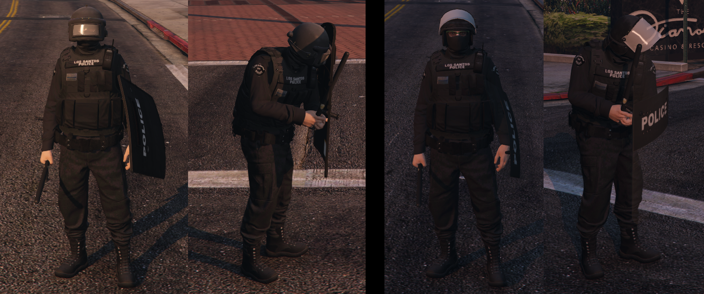

# Altv CSharp Police Shields



## Features

This ressource adds a useable ballistic & riot shield. They
- Block bullets
- Can be used with a nightstick as sidearm

## Usage

To use from shield item part **serverside**: 

```
if (!player.HasData("shield")){
	bool shieldstate = true;
	int istate = shieldstate ? 1 : 0;
	player.SetStreamSyncedMetaData("shield", istate);
	player.SetStreamSyncedMetaData("shieldstatus", istate);
} else {
	player.DeleteStreamSyncedMetaData("shield");
	player.DeleteStreamSyncedMetaData("shieldstatus");
}```

Serverside events in serverside_templates.cs :)

## Client setup

If you just want to test the ressource add the following

to the **index.js** or whatever:

```
import * as shield from '/your_framework_ui_folder/shield.js';
```

## Credits

Client part from benstrobel 

CSharp Server part from DerStr1k3r


With that anyone can (un)equip the shield by pressing "0"
